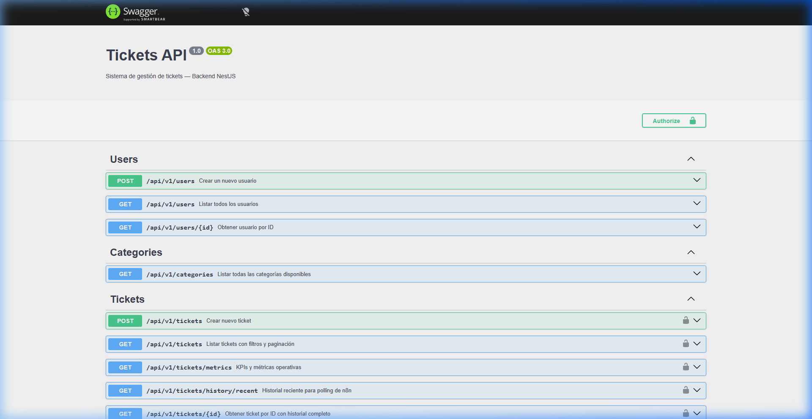
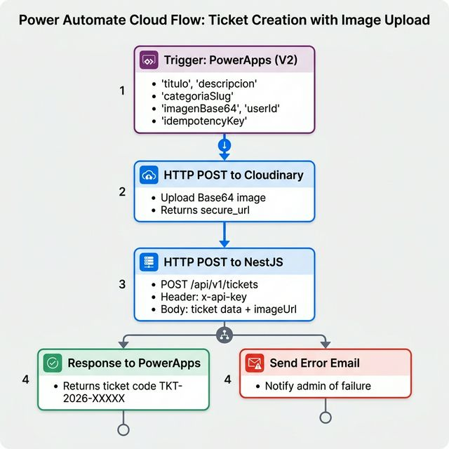
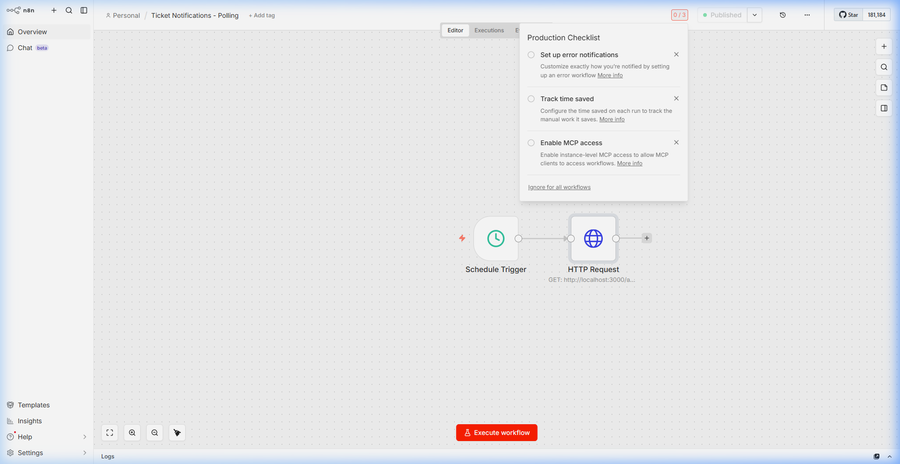

# 🎫 Sistema de Gestión de Tickets — Enterprise Ticket Management System

> Backend REST API + Automatización empresarial para gestión de incidentes técnicos.
>
> **Stack**: NestJS · TypeORM · PostgreSQL · Power Apps · Power Automate · n8n · Cloudinary

---

## 📐 Arquitectura del Sistema


```
Power Apps (Móvil) → Power Automate (Orquestador) → NestJS (Backend) → PostgreSQL (DB)
                                                                      ↳ n8n (Notificaciones)
```

### Separación de Responsabilidades

| Componente | Responsabilidad | ¿Lógica de negocio? |
|---|---|---|
| **Power Apps** | Formulario móvil, captura de datos y foto | ❌ Solo UI |
| **Power Automate** | Orquestar upload de imagen y llamar al backend | ❌ Solo mensajero |
| **NestJS** | Validación, prioridad, transacciones ACID, API REST | ✅ **Toda la lógica** |
| **PostgreSQL** | Persistencia relacional con integridad referencial | ❌ Solo storage |
| **n8n** | Polling de cambios de estado → notificaciones | ❌ Solo reactor |

---

## ⚡ Características Principales

- ✅ **Transacciones ACID** — Si falla el historial, hace rollback del ticket
- ✅ **Prioridad automática** — Detecta palabras clave ("caído", "urgente") → CRITICAL
- ✅ **Código correlativo** — Genera `TKT-2026-00001`, `TKT-2026-00002`...
- ✅ **Idempotencia** — Previene duplicados por retries de Power Automate
- ✅ **5 KPIs nativos** — MTTR, SLA compliance, volumen por categoría
- ✅ **Swagger UI** — Documentación interactiva en `/docs`
- ✅ **Seed automático** — Categorías se insertan al iniciar
- ✅ **API Key Auth** — Middleware de autenticación simple para MVP

---

## 🗂️ Estructura del Proyecto

```
src/
├── main.ts                             # Entry: Swagger, CORS, ValidationPipe
├── app.module.ts                       # Módulo raíz con TypeORM async
├── common/
│   ├── enums/ticket.enum.ts            # TicketStatus, TicketPriority
│   └── middleware/api-key.middleware.ts # Autenticación MVP
├── users/
│   ├── entities/user.entity.ts         # UUID, email, phone
│   ├── dto/create-user.dto.ts          # Validaciones class-validator
│   ├── users.service.ts
│   ├── users.controller.ts
│   └── users.module.ts
├── categories/
│   ├── entities/category.entity.ts     # slug, sla_hours
│   ├── categories.service.ts           # Seed automático en OnModuleInit
│   ├── categories.controller.ts
│   └── categories.module.ts
├── tickets/
│   ├── entities/
│   │   ├── ticket.entity.ts            # FK → User, Category, idempotency_key
│   │   └── ticket-history.entity.ts    # CASCADE DELETE, índice para n8n
│   ├── dto/
│   │   ├── create-ticket.dto.ts        # Validación completa con Swagger docs
│   │   ├── update-status.dto.ts        # Cambio de estado + nota
│   │   └── filter-tickets.dto.ts       # Paginación + filtros
│   ├── tickets.service.ts              # 🔥 CORE: ACID, idempotencia, KPIs
│   ├── tickets.controller.ts           # 6 endpoints documentados
│   └── tickets.module.ts               # API Key middleware
└── seed/seed.ts                        # Datos de prueba
```

---

## 🚀 Instalación y Ejecución

### Requisitos
- **Node.js** ≥ 18
- **PostgreSQL** 14+
- **npm** ≥ 9

### Pasos

```bash
# 1. Clonar el repositorio
git clone https://github.com/TU_USUARIO/ticket-management-system.git
cd ticket-management-system

# 2. Instalar dependencias
npm install

# 3. Configurar PostgreSQL
# Crear la base de datos:
psql -U postgres -c "CREATE DATABASE tickets_db;"

# 4. Configurar variables de entorno
# Editar .env con tus credenciales de PostgreSQL

# 5. Iniciar en modo desarrollo
npm run start:dev

# 6. (Opcional) Insertar datos de prueba
npx ts-node src/seed/seed.ts
```

### Variables de Entorno (.env)

```env
APP_PORT=3000
DB_HOST=localhost
DB_PORT=5432
DB_USER=postgres
DB_PASS=postgres
DB_NAME=tickets_db
API_KEY=power-automate-secret-key-2026
```

---

## 📡 API Endpoints

| Método | Ruta | Auth | Descripción |
|---|---|---|---|
| `POST` | `/api/v1/tickets` | 🔒 API Key | Crear ticket (Power Automate) |
| `GET` | `/api/v1/tickets` | 🔒 API Key | Listar con filtros + paginación |
| `GET` | `/api/v1/tickets/:id` | 🔒 API Key | Ticket detallado con historial |
| `PATCH` | `/api/v1/tickets/:id/status` | 🔒 API Key | Cambiar estado (ACID) |
| `GET` | `/api/v1/tickets/metrics` | 🔒 API Key | 5 KPIs operativos |
| `GET` | `/api/v1/tickets/history/recent` | 🔒 API Key | Polling para n8n |
| `POST` | `/api/v1/users` | 🔓 | Crear usuario |
| `GET` | `/api/v1/users` | 🔓 | Listar usuarios |
| `GET` | `/api/v1/users/:id` | 🔓 | Usuario por ID |
| `GET` | `/api/v1/categories` | 🔓 | Listar categorías |

### Swagger UI



Disponible en: `http://localhost:3000/docs`

---

## 🗄️ Modelo de Datos

```
┌──────────┐        ┌──────────────┐        ┌───────────────┐
│  users   │───────▶│   tickets    │◀───────│  categories   │
│          │        │              │        │               │
│  id (PK) │        │  id (PK)     │        │  id (PK)      │
│  name    │        │  code (UQ)   │        │  name         │
│  email   │        │  title       │        │  slug (UQ)    │
│  phone   │        │  description │        │  sla_hours    │
│  dept    │        │  status      │        └───────────────┘
└──────────┘        │  priority    │
      │             │  image_url   │
      │             │  created_by  │───FK──▶ users
      │             │  assigned_to │───FK──▶ users
      │             │  category_id │───FK──▶ categories
      │             └──────┬───────┘
      │                    │ 1:N (CASCADE)
      │             ┌──────▼───────────┐
      └────────────▶│ ticket_history   │
                    │                  │
                    │  id (PK)         │
                    │  ticket_id (FK)  │
                    │  from_status     │
                    │  to_status       │
                    │  changed_by (FK) │
                    │  note            │
                    └──────────────────┘
```

---

## 📱 Power Apps — Formulario Móvil


> Power Apps captura los datos del incidente y dispara el flujo de Power Automate.
> No ejecuta lógica de negocio — eso lo hace NestJS.

---

## ⚡ Power Automate — Flujo Orquestador



**Flujo**: Power Apps → Cloudinary (upload imagen) → NestJS (POST ticket) → Respuesta al usuario.

---

## 🔄 n8n — Notificaciones Automáticas



- **Schedule Trigger**: cada 60 segundos
- **HTTP GET**: `/api/v1/tickets/history/recent?minutes=2`
- **Acción**: Si `toStatus = RESOLVED` → WhatsApp / Slack / Email

---

## 📊 KPIs y Reportería

El endpoint `GET /api/v1/tickets/metrics` retorna estos 5 KPIs:

1. **Volumen por estado** — Cuántos tickets hay en cada estado
2. **MTTR por categoría** — Tiempo promedio de resolución en horas
3. **Distribución por prioridad** — LOW, MEDIUM, HIGH, CRITICAL
4. **Cumplimiento de SLA** — % de tickets resueltos dentro del SLA
5. **Tickets críticos vencidos** — Tickets CRITICAL abiertos > 4 horas

---

## 🛡️ Manejo de Riesgos

| Riesgo | Mitigación |
|---|---|
| Duplicados por retry de Power Automate | `idempotencyKey` con índice UNIQUE |
| Fallo parcial en DB | Transacciones ACID (rollback automático) |
| n8n pierde estado de polling | Polling por `created_at` con ventana de tiempo |
| Cloudinary down | `imageUrl` es opcional, ticket se crea sin imagen |
| Timeout en Power Automate (120s) | Backend responde en <200ms |

---

## 🧰 Tecnologías

- **Runtime**: Node.js 24, TypeScript
- **Framework**: NestJS 11
- **ORM**: TypeORM (PostgreSQL driver `pg`)
- **Validación**: class-validator + class-transformer
- **Documentación**: Swagger/OpenAPI 3.0
- **Base de datos**: PostgreSQL 18
- **Automatización**: n8n (self-hosted)
- **Interfaz**: Power Apps (Canvas App)
- **Orquestación**: Power Automate (Cloud Flow)
- **Storage**: Cloudinary / S3

---

## 📝 Licencia

MIT
