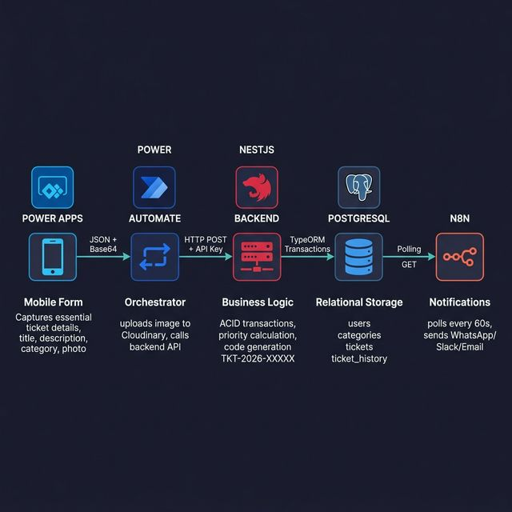

# Ticket Management System

API REST para registrar, priorizar y dar seguimiento a incidentes. El proyecto demuestra diseño transaccional con NestJS, TypeORM y PostgreSQL: una operación de ticket y su historial se confirman juntas o se revierten juntas.



## Qué resuelve

- Creación idempotente de tickets para tolerar reintentos de clientes y automatizaciones.
- Códigos correlativos seguros ante concurrencia (`TKT-2026-00001`).
- Priorización automática basada en el contenido del incidente.
- Flujo de estados validado y registro auditable de cada cambio.
- Consultas paginadas, historial reciente y métricas operativas.
- Contratos de entrada validados y documentación OpenAPI.

Las integraciones con Power Apps, Power Automate y n8n son consumidores posibles de la API; no son requisitos para ejecutar el backend.

## Decisiones técnicas destacadas

- Las claves de idempotencia y los consecutivos usan bloqueos transaccionales de PostgreSQL para evitar carreras.
- Los cambios de estado se serializan por ticket y solo permiten estas rutas:

```text
OPEN -> IN_PROGRESS | PENDING
IN_PROGRESS -> PENDING | RESOLVED
PENDING -> IN_PROGRESS | RESOLVED
RESOLVED -> CLOSED
```

- `API_KEY` es obligatoria, sin secretos de respaldo dentro del código.
- Usuarios, categorías y tickets están protegidos mediante `x-api-key`.
- CORS usa una lista exacta definida por `CORS_ORIGINS`.
- El esquema productivo se administra mediante migraciones; `DB_SYNC` solo puede habilitarse fuera de producción.

## Stack

- Node.js 20+ y TypeScript
- NestJS 11
- TypeORM 0.3
- PostgreSQL 16+
- Jest y Supertest
- Swagger/OpenAPI

## Inicio rápido

Requisitos: Node.js 20 o superior, npm y PostgreSQL. También se incluye Docker Compose para levantar PostgreSQL y Adminer.

```bash
git clone https://github.com/Andrewshumeiker/ticket-management-system.git
cd ticket-management-system
npm ci
cp .env.example .env
docker compose up -d postgres
npm run migration:run
npm run start:dev
```

Antes de iniciar, cambia `API_KEY` y revisa las credenciales de `.env`. Para generar datos demostrativos en una base vacía:

```bash
npm run seed
```

Swagger queda disponible en `http://localhost:3000/docs` y la API en `http://localhost:3000/api/v1`.

## Configuración

| Variable | Requerida | Propósito |
|---|---:|---|
| `DB_HOST` | Sí | Host de PostgreSQL |
| `DB_PORT` | No | Puerto; por defecto `5432` |
| `DB_USER` | Sí | Usuario de PostgreSQL |
| `DB_PASS` | Sí | Contraseña de PostgreSQL |
| `DB_NAME` | Sí | Base de datos |
| `API_KEY` | Sí | Secreto de al menos 24 caracteres |
| `CORS_ORIGINS` | No | Orígenes exactos separados por comas |
| `DB_SYNC` | No | Sincronización local; nunca se activa en producción |
| `DB_LOGGING` | No | Registra consultas de TypeORM |
| `APP_PORT` | No | Puerto HTTP; por defecto `3000` |

## API

Todas las rutas requieren el encabezado `x-api-key`.

| Método | Ruta | Descripción |
|---|---|---|
| `POST` | `/api/v1/tickets` | Crea un ticket |
| `GET` | `/api/v1/tickets` | Lista tickets con filtros y paginación |
| `GET` | `/api/v1/tickets/:id` | Obtiene ticket e historial |
| `PATCH` | `/api/v1/tickets/:id/status` | Cambia el estado de forma transaccional |
| `GET` | `/api/v1/tickets/metrics` | Devuelve indicadores operativos |
| `GET` | `/api/v1/tickets/history/recent` | Devuelve cambios recientes |
| `POST` | `/api/v1/users` | Crea un usuario |
| `GET` | `/api/v1/users` | Lista usuarios |
| `GET` | `/api/v1/categories` | Lista categorías |

Ejemplo:

```bash
curl -X POST http://localhost:3000/api/v1/tickets \
  -H "Content-Type: application/json" \
  -H "x-api-key: $API_KEY" \
  -d '{
    "title": "Servidor de pagos no responde",
    "description": "El servicio está caído y bloquea transacciones",
    "categorySlug": "infrastructure",
    "userId": "00000000-0000-0000-0000-000000000000",
    "idempotencyKey": "incident-2026-001"
  }'
```

## Calidad y verificación

```bash
npm run verify
```

El comando ejecuta lint, 8 pruebas unitarias, 3 pruebas HTTP de integración y compilación. GitHub Actions repite la misma verificación en cada push y pull request.

La funcionalidad principal también fue comprobada contra PostgreSQL real: creación idempotente, prioridad crítica, rechazo de una transición inválida, cambio válido y consulta de métricas.

## Estructura

```text
src/
  common/       enums y autenticación por API key
  config/       validación del entorno
  database/     DataSource y migraciones
  users/        usuarios solicitantes y técnicos
  categories/   categorías y SLA
  tickets/      reglas, persistencia, historial y métricas
  seed/         datos demostrativos opcionales
test/           pruebas HTTP de integración
```

## Seguridad y alcance

La API key es una medida apropiada para una integración de servicio a servicio pequeña. Para un producto multiusuario se debería incorporar identidad por usuario, roles, rotación de secretos, rate limiting y observabilidad antes de exponerlo públicamente.

## Licencia

Este repositorio se distribuye como código de portafolio sin una licencia de uso abierta (`UNLICENSED`).
